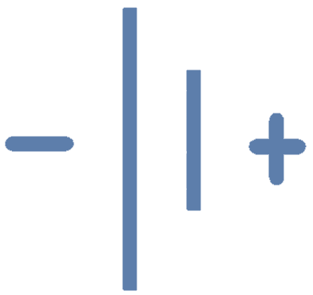
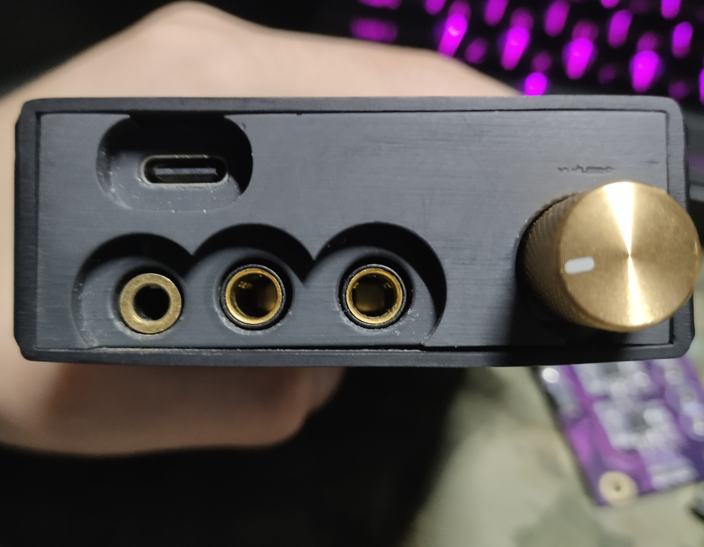

<h1 align="center">ELP12-Levithan-II</h1>

    
    ELP-12 FROM SIREN..

## Overview

A real hifi player，It is true music ( ToT )

 

 

 

 

## Features

This project aims to adapt to different customization scenarios using highly customizable acoustic hardware modules.~~Trade expensive capacitors for better sound(笑~~

The core components can be divided into `Power Board`, `Digital Interface Board`, `DAC Board`, and `Amp Card`.

- Power Board

  This board is the largest board and the base board of the project, providing positive and negative power and digital power for other circuits, as well as providing a headphone jack. Power can be supplied to the circuit through two `16340` batteries

 

- Digital Interface Board

  This board converts the signal of the playback device into the input signal of the DAC, such as (USB->IIS), which may require the use of a good crystal oscillator and a clean interface power supply to achieve the best performance

 

- DAC Board

  This board is the soul of the project, because the tone generator is here, and from here on it's the realm of analog circuits.

 

- Amp Card

  And then there's my favorite part, where the audio signal ends up on the board, passes through the Amp circuit, and is enough to drive headphones with up to 600r.

  In addition, some special circuits can be used to create different tones, which of course need to be achieved by the user himself.

  Therefore, I made this board into a hot-swappable design, so that users can change their needs at any time.

  I have made a total of two versions, no matter which version is good, I like the design of the upper and lower layers, the upper layer is the Amp layer, the lower layer is the impedance matching and buffer layer, so that the two double layers can achieve the effect of a four-layer board, and at the same time, it is easy to disassemble and assemble.

  

   
   
  

  

   
   
  

Example of an overall assembly (without housing):

 

## Whats New

It's clear that we've made significant improvements in size and integration.Unfortunately, it is not possible to plug and unplug the op amp directly.

Here is the actual circuit board of version 1.0:

 

